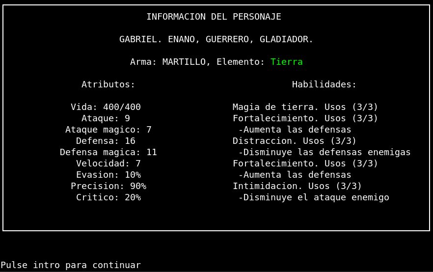
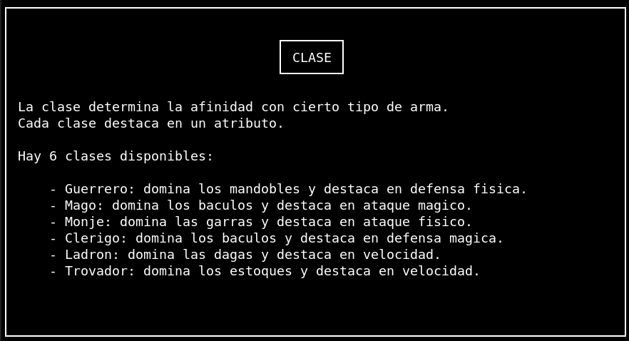

# Proyecto Dungeon Crawler

**Nota: esta documentación esta todavia en construcción** 

Se trata de un juego para terminal que funciona con comandos de entrada. Esta escrito en cpp.

Terminales soportadas actualmente: bash.

## Como jugar

Primero hay que descargar el ejecutable `pdg` ubicado en `bin/`

Una vez descargado se tiene que acceder desde la terminal al directorio donde se haya guardado el archivo, y ejecutarlo con `./pdg`

## Estructura del proyecto
---
```bash
ProyectoDungeonCrawler/
|
├─ bin/
|  └─ programa    # Ejecutable final
├─ doc/           # Documentacion sobre el proyecto
├─ include/       # Todas las cabezeras
├─ Makefile       # Makefile para compilar el proyecto
└─ src/...        # Todos los .cpp organizados en subdirectorios
```

## Objetivo del juego


## Pantallas

A continuación se muestran las pantallas más importantes del juego. 

Para moverse entre ellas se introduciran por teclado números o letras según corresponda.


### Pantalla de titulo:


### Pantalla de creacion de personaje:

Se muestra al pulsar la opción Jugar, y sirve para configurar el personaje antes de empezar a jugar.

Al terminar de configurarlo se muestra una pantalla con la información resumida del personaje creado.





### Pantalla como jugar

Se accede pulsando la opción 2 en la pantalla principal.

Dentro de esta pantalla hay mas pantallas donde se explican todos los detalles del juego. Se recomienda leerla antes de jugar por primera vez.

A continuación se muestran algunas de las pantallas:




