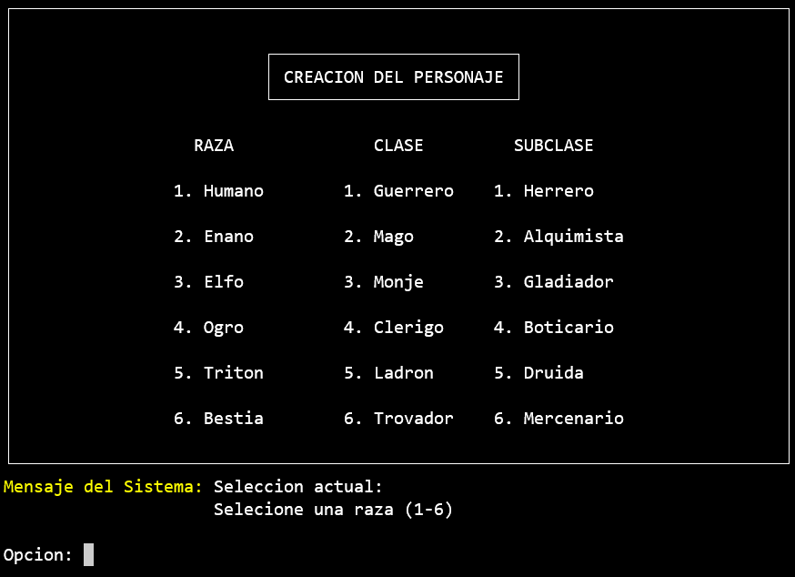

# Proyecto Dungeon Crawler

Se trata de un juego para terminal que funciona con comandos de entrada. Esta escrito en cpp.

Terminales soportadas actualmente: bash y windows cmd.

El juego esta diseñado para ejecutarse en un tamaño de terminal de 80x24 caracteres, por lo que no es reescalable y no se verá correctamente si el tamaño de la terminal es menor.

## Como jugar

### Para terminales bash:

Primero hay que descargar el ejecutable `pdg` ubicado en `bin/`

Una vez descargado se tiene que acceder desde la terminal al directorio donde se haya guardado el archivo, y ejecutarlo con `./pdg`

### Para terminales windows:

Ejecutar el script `pdg_win` ubicado en `bin/` para que se configure el cmd y pueda imprimir caracteres ANSI necesarios para la correcta visualización del juego.


## Estructura del proyecto
---
```bash
ProyectoDungeonCrawler/
|
├─ bin/
|  └─ programa    # Ejecutable final
├─ doc/           # Documentacion sobre el proyecto
├─ include/       # Todas las cabezeras
├─ Makefile       # Makefile para compilar el proyecto
└─ src/...        # Todos los .cpp organizados en subdirectorios
```

## Objetivo del juego


## Pantallas

A continuación se muestran las pantallas más importantes del juego. 

Para moverse entre ellas se introduciran por teclado números o letras según corresponda.


### Pantalla de titulo:


### Pantalla de creacion de personaje:

Se muestra al pulsar la opción Jugar, y sirve para configurar el personaje antes de empezar a jugar.

Primero se pregunta si el personaje sera creado manualmente o de manera aleatoria.


Si se elige crearlo manualmente se muestran las siguientes pantallas para configurarlo.




Al terminar de configurarlo se muestra una pantalla donde el jugador tiene la oportunidad de mejorar tres atributos de su personaje.


Los atributos que se van a mejorar se muestran con un '*'. Se puede mejorar varias veces el mismo atributo.
En el ejemplo se mejora dos veces la vida y una vez el ataque.


Despues de mejorar el personaje, se mostrara la pantalla con el aumento de los atributos seleccionados, y despues, la pantalla con la información del personaje.

Si se ha elegido un personaje aleatorio, se pasa directamente a esta pantalla tras seleccionar 'Aleatorio' en la pantalla de creacion de personaje.


### Pantalla de piso

Se muestra en cada piso que avancemos en la mazmorra. Permite avanzar de piso, ver información del personaje o ver estadisticas de la partida.

Pantalla de piso:


Pantalla de estadísticas:


Al avanzar de piso puedemos encontrar enemigos, o puede suceder un evento.

### Pantalla de combate

Se muestra cuando al avanzar de piso nos encontramos con un enemigo.

En cada turno se va actualizando la información de la batalla y las estadisticas de los personajes.

El combate termina cuando uno de los dos personajes es derrotado.


Si el jugador resulta vencedor en el combate, sube de nivel, y se muetra una pantalla con los atributos incrementados.


### Pantalla de evento

Se muestra cuando ocurre un evento al avanzar de piso.

Primero se pregunta si se quiere aceptar el evento, y una vez aceptado, se muestra el resultado.

Evento antes de ser aceptado:


Evento despues de ser aceptado:


### Pantalla como jugar

Se accede pulsando la opción 2 en la pantalla principal.

Dentro de esta pantalla hay mas pantallas donde se explican todos los detalles del juego. Se recomienda leerla antes de jugar por primera vez.

Todas las pantallas de esta sección se pueden leer en el [manual](MANUAL.md).
